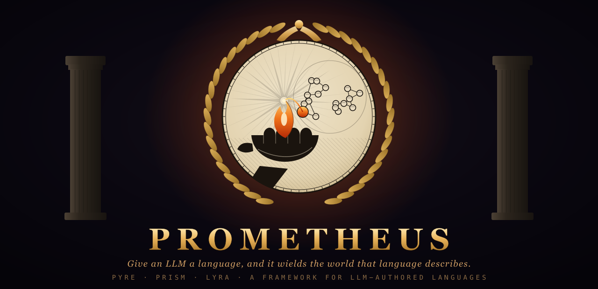
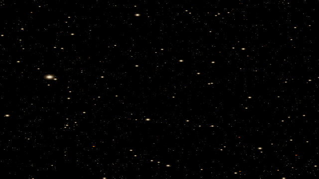
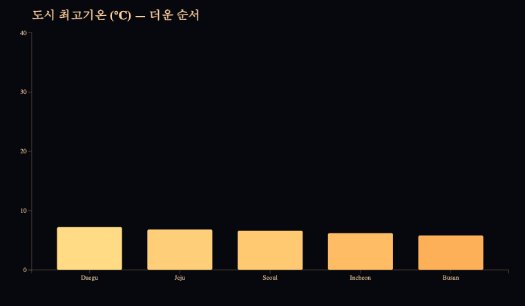
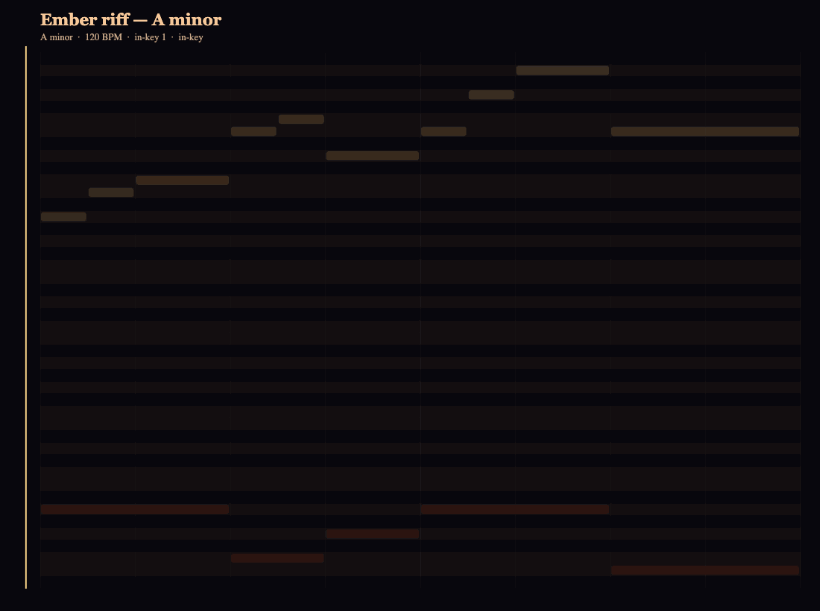

<p align="center">
  
</p>

# 🔥 Prometheus

**Give an LLM a language, and it can wield the world that language describes.**

**[▶ Live demo — run all three in your browser](https://anyejun.github.io/prometheus/)** · [Launch kit](LAUNCH.md) · [Contract](CONTRACT.md)

Language is a lossy compression of reality. An LLM is a language engine. So the
way to hand an LLM a *new* ability is not to retrain it — it's to give it a
**small language for a domain**, plus a deterministic engine that turns that
language into effect, plus a way to tell good output from bad.

Prometheus is the **framework** that makes every such capability the *same shape*,
so one critic loop and one skill format drive any medium. Reuse the world's best
materials as the backend — **three.js** for 3D, **D3** for charts, Tone.js for
music — and give the LLM the *language* on top.

## The four slots (every capability, no exceptions)

| Slot | What it is | Reused backend |
|------|-----------|----------------|
| **Grammar** | the DSL the LLM writes (`dsl/GRAMMAR.md`) | — |
| **Executor** | turns the DSL into effect (`engine/`) | three.js · D3 · … |
| **Critic** | an objective `score()` + a rubric | — |
| **Seed** | worked examples | — |

The twist that makes this new: in classic language-oriented programming a *human*
writes the DSL. Here the **LLM writes it and a critic grades it** — so the
languages are designed as the **output of a probabilistic generator and the input
of a deterministic verifier**. And the LLM is the **director**, never the
pixel/geometry engine. That split is the only "infinitely extensible LLM" that
actually runs.

Everything shared lives in **[CONTRACT.md](CONTRACT.md)**: the `window.PROM`
runtime interface and the universal critic loop. Because the loop only speaks
`apply / settle / seek / score` + screenshots, *the same procedure* authored a
drone show and a chart.

## Capabilities

### 🔥 [PYRE](skills/pyre) — photo → drone-show point cloud  *(backend: three.js)*
<p align="center"></p>

Drop a photo; it shatters into thousands of glowing embers that assemble into the
image, then breathe and swirl. The LLM authors a **choreography DSL**; a critic
scores legibility. `legibility 0.908 → 0.972` in a live loop run.

### 🔺 [PRISM](skills/prism) — data → animated chart  *(backend: D3)*
<p align="center"></p>

Numbers + a vibe → an animated bar chart. The critic gate is **encoding
fidelity** (Pearson corr of bar height vs value) — a chart that lies about the
data *fails the gate*. Proves the contract generalizes past 3D.

### 🎵 [LYRA](skills/lyra) — text → music  *(backend: Tone.js)*
<p align="center"></p>

A musical intent → a short playable piece with a piano roll. The critic gate is
**in-key ratio** — a melody that wanders out of its declared key *fails the gate*.
Takes the contract to a **non-visual** medium (audio). Live loop caught an off-key
note (`inKey 0.8 → 1.0`).

## Add a new language — one command
```
bin/prometheus-new lyra music      # stamps skills/lyra/ from template/
```
Fill the four slots (the TODOs), and the universal loop already drives it.
*Next flames: motion, SVG scenes, shaders, poetry with meter…*

## Try it
Easiest: **[the live demo](https://anyejun.github.io/prometheus/)**. Or locally:
```
python3 -m http.server 8778 --directory .
open http://localhost:8778/skills/pyre/engine/index.html     # drag a photo on
open http://localhost:8778/skills/prism/engine/index.html
open http://localhost:8778/skills/lyra/engine/index.html     # press ▶ for sound
```
